# 前言

<table>
<thead>
<tr>
<th><strong>版本号</strong></th>
<th>PickWiz：1.8.0PickLight：1.8.0GLIA：0.4.9RLIA：0.3.4MixedAI：0.6.0DexSim：0.3.1Camera SDK:<ul>
<li>Xema：1.5.4.8</li>
<li>Finch：1.2.1.3</li>
<li>Sparrow：3.5.2</li>
<li>Kingfisher-R: 0.1.1</li>
<li>Stereo：4.3.4</li>
<li>Enumerate：1.0</li>
</ul></th>
</tr>
</thead>
</table>

PickWiz 1.8 是3D视觉引导产品的重大升级，对比 PickWiz 1.7，我们针对 拆垛、无序抓取、有序上下料、定位装配 四大场景，做了大量的功能新增和体验优化，重大更新包括：**视觉计算加速、影子模式支持更多场景、一键联通支持训练成像模型、新模型训练架构、SPARROW-SC新相机、纸箱多抓、机器人外挂脚本&#x20;**&#x7B49;等。极大地提高了功能的丰富度，同时降低了学习成本。具体更新如下：

> **注意**
>
> 1. PickWiz 1.8 不支持打开 PickWiz 1.7+ 或更早版本项目配置，如需升级，要基于 PickWiz V1.8 重新配置项目。
>
> 2. 如从PickWiz 1.7+版本升级至1.8+时，至少升级至PickWiz 1.8.0.1较稳定版本（版本说明见[**下方**](https://dexforce.feishu.cn/wiki/YTu1wAW26iTvITkgEsbcvcrRnB3#share-DSAIdmv5ZoqR3fxhahkcmU1BnTc)）。

> 蓝色背景表示 重要功能更新

# 功能新增

## 1. 欢迎页

1. 有序上下料场景中，新增 “面型工件有序上下料（并行化）” 场景，场景特点在 视觉计算耗时少，减少了中间计算过程（实例生成过滤、姿态生成等），直接识别生成抓取点，具体场景使用见：[ 面型工件有序上下料（并行化）视觉参数调整指南](https://dexforce.feishu.cn/wiki/IlX0wexxfiEFnhkyzaEcfYUPnZM)

   > **注意**
   >
   > 该版本中，此功能仍为**测试中**状态，因存在3D匹配不准的风险，故项目使用前，需要提前在场内稳定性测试；以及提项目支持单，找研发人员（ ）评估功能实践性。

2. “视觉分类”功能选项 新增了基于颜色的分类功能，适用于以颜色作为工件/其他场景物体的分类特征的情况，具体逻辑见：[ 视觉分类使用指南](https://dexforce.feishu.cn/wiki/YoZ8woaOSiOH4PkAbDycoPh4nRg?from=from_copylink)

3. 拆垛、有序场景中，功能选项新增了“**隔板和底托检测**”，适用于每层物料间存在隔板，以及底部放置了底托的场景，可通过`视觉分类`分别录入隔板、底托、工件的三种数据类型，具体使用流程见：[ 隔板和底托检测使用指南](https://dexforce.feishu.cn/wiki/HEEew5C3bi20spkODtFchoe5nhR)

## 2. 菜单

1. 支持计算多条历史数据的重复定位精度。

   **功能说明**

   批量选中多条历史数据后，在重复定位精度模块中点击`开始计算`即可。

   由于历史数据重复计算的结果不会变化，故重复计算次数固定为1，不支持修改。

   **适用场景**

   无法使用项目现场工控机进行调试时，用户会拷贝历史数据至另一台工控机，可针对这些历史数据进行重复定位精度计算来排查稳定性。

   > **使用建议**
   >
   > 需要保证：
   >
   > 1. 使用同一作业场景下的历史数据。
   >
   > 2. 多次识别的第一个实例结果是同一实例且同一抓取点。
   >
   > 否则结果将不符合预期（如极差值很大）。

2. 新增了 视觉温漂实时校正 的功能。

   **使用说明**

   见：[ 标定球漂移校正指南](https://dexforce.feishu.cn/wiki/ShViwFmlrigMBGk2HUMc3ZcKn3c?from=from_copylink)

   **适用场景**

   相机在现场长时间作业后，存在较明显的位移、温漂的场景。

3. 支持自定义 3D 可视化视窗的背景色，避免无法分辨与背景色差小的场景点云。

   **功能说明**

   菜单可打开颜色编辑器，主要包含了两种类型颜色设置：纯色背景、渐变色背景；同时支持一键“恢复默认背景”。

   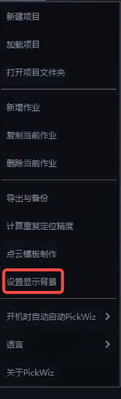

   

4. 支持“打开项目文件夹”。

   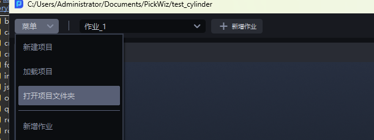

## 3. 相机

1. 支持新上市的相机Sparrow-SC，未来项目可走正常流程供货。

   **相机概述**

   Sparrow-SC 对标 旗舰款相机Xema-SCW，相比之下，优势如下：

   1. 彩色图像输出：适用更广泛的应用场景；

   2. 精度更高：精度优于Xema-SCW相机；

   3. 采图节拍更快：性能优于Xema-SCW相机；

   4. 高使用稳定性：避免了温漂导致的精度丢失情况；

   5. 高性价比：价格更低，但整体优势优于Xema-SCW。

   具体介绍、功能使用可参考：&#x20;

   **相机指标对比**

2. 支持KINGFISHER相机进行一键联通训练成像模型。

   > 具体使用操作见：[ 一键联通训练成像模型](https://dexforce.feishu.cn/wiki/JQnTw5claiCFUZkLzU8cHBYnn3f)

3. 支持KINGFISHER相机在软件侧进行影子模式的数据收集和训练。

   > 具体使用操作见：[ 如何使用KINGFISHER影子模式](https://dexforce.feishu.cn/wiki/MYX0wFnvFippq9kV2fqcL1vBngb)

4. XEMA相机新增了相机参数的注释，便于理解参数作用和调整方式。

   

5. 支持相机实时调参：参数一经改动，系统会自动采集图像和显示调参后的成像效果，可提高调参效率。

6. 针对XEMA、SPARROW相机（同时支持彩色和黑白模式），2D图叠加曝光参数的曝光类型新增了HDR，即高动态模式。

   **适用场景**

   高动态可使图像层次更分明，适用于明暗差别大（特别是面对反光工件）场景的2D图像处理（与3D点云成像无关）。

   **调参建议**

   使用高动态时，可根据具体的场景和工件，选择**高动态曝光次数**，取值范围 2\~6，默认2。若2D图像质量不佳，应当增加组数对物体进行多次曝光，以达到最佳的成像质量。

   > 建议在满足2D识别精度/识别率的情况下，使用更少的高动态曝光次数。

   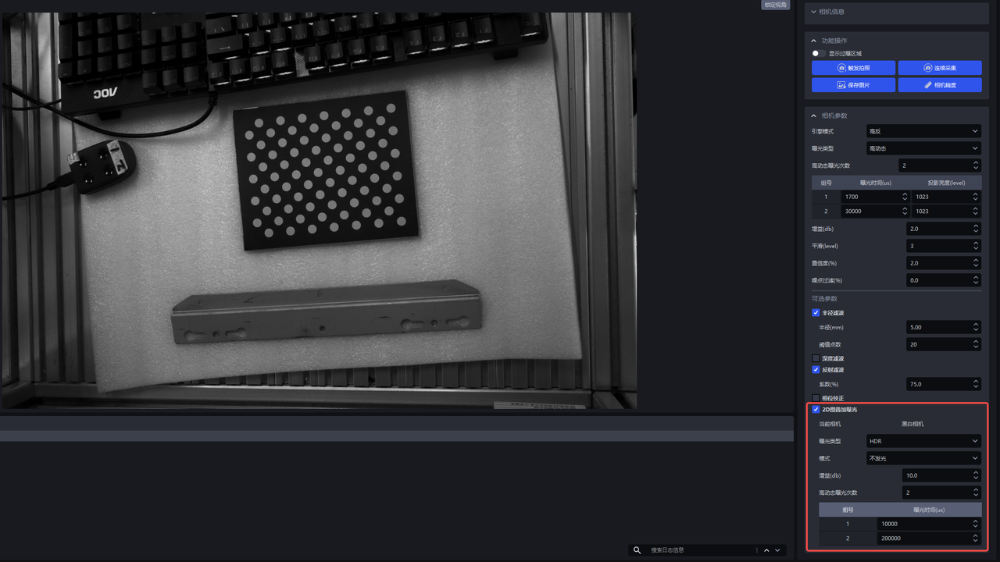

7. 校正相机精度功能支持默认保存样本。若首次打开校正相机精度功能时，或出现系统异常闪退再次打开软件时，可恢复样本数据，无需重新采集。

   > 解决的问题：旧版本会在关闭功能模块或闪退时重置样本栏，需要重新采集才可再次校正，比较繁琐。

## 4. 机器人

1. 新增多个通讯指令：

   <table>
   <thead>
   <tr>
   <th>指令类型</th>
   <th>指令名称</th>
   <th>指令</th>
   <th>值</th>
   <th>产品截图</th>
   <th>作用</th>
   <th>支持场景</th>
   </tr>
   </thead>
   <tbody>
   <tr>
   <td>机器人发送至PickWiz</td>
   <td>拍照计算类型</td>
   <td>co</td>
   <td>6</td>
   <td></td>
   <td>触发工控机关机</td>
   <td>所有</td>
   </tr>
   <tr>
   <td></td>
   <td>拍照计算类型</td>
   <td>co</td>
   <td>5</td>
   <td></td>
   <td>触发运行选中的历史数据<blockquote>
   
仅支持运行单条历史数据，不支持批量运行历史数据。

   </blockquote><blockquote>
   
<strong>注意安全</strong>

   
现场需要谨慎使用该指令，避免误触发了历史数据的运行，走错点位导致机器人撞机。

   </blockquote></td>
   <td>所有</td>
   </tr>
   <tr>
   <td></td>
   <td>拍照计算类型</td>
   <td>co</td>
   <td>4</td>
   <td></td>
   <td><a href="https://dexforce.feishu.cn/wiki/ShViwFmlrigMBGk2HUMc3ZcKn3c#share-EofTdmi2ZoNBmOxYujyc0BqpnrA">触发视觉温漂作业运行并计算漂移量Δ</a></td>
   <td>所有</td>
   </tr>
   <tr>
   <td></td>
   <td>单行最大组合数</td>
   <td>max_merge_num</td>
   <td>自定义</td>
   <td></td>
   <td>支持将‘单行最大组合数’传入纸箱组合策略，且优先使用机器人传入值（相较于前端设置值）</td>
   <td>纸箱单拆</td>
   </tr>
   <tr>
   <td></td>
   <td>最大组合行数</td>
   <td>max_merge_lines</td>
   <td>自定义</td>
   <td></td>
   <td>支持将‘最大组合行数’传入纸箱组合策略，且优先使用机器人传入值（相较于前端设置值）</td>
   <td>纸箱单拆</td>
   </tr>
   <tr>
   <td>PickWiz发送至机器人</td>
   <td>分类类型</td>
   <td>cls_id</td>
   <td>系统自动分配</td>
   <td></td>
   <td>返回 功能选项 - 视觉分类 在工件模块中的分类器里的类型ID</td>
   <td>拆垛、有序</td>
   </tr>
   <tr>
   <td></td>
   <td>场景分类类型</td>
   <td>scn_cls_id</td>
   <td>系统自动分配</td>
   <td>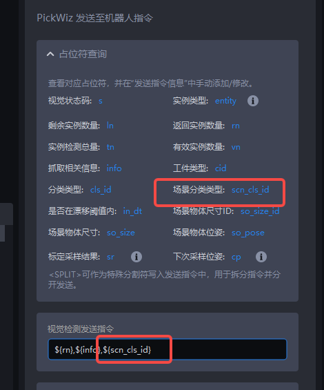</td>
   <td>返回 功能选项 - 隔板与底托检测 在工件模块中的分类器里的类型ID</td>
   <td>拆垛</td>
   </tr>
   <tr>
   <td></td>
   <td>是否在漂移阈值内</td>
   <td>in_dt</td>
   <td>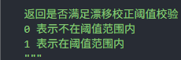0表示不在阈值内1表示在阈值内</td>
   <td></td>
   <td><a href="https://dexforce.feishu.cn/wiki/ShViwFmlrigMBGk2HUMc3ZcKn3c#share-DRQSdrWZNouTL6xmv0TcggYLnsj">返回是否满足漂移校正阈值的判断</a></td>
   <td>所有</td>
   </tr>
   <tr>
   <td></td>
   <td>场景物体尺寸ID</td>
   <td>so_size_id</td>
   <td>系统自动分配</td>
   <td></td>
   <td>返回本次识别的场景物体（一般为料框）尺寸对应的索引参考：<a href="https://dexforce.feishu.cn/wiki/MYTmwgFoCiNhV0kNsQHcMeaHn2d?from=from_copylink"> 场景物体使用指南</a></td>
   <td>所有</td>
   </tr>
   <tr>
   <td></td>
   <td>场景物体尺寸</td>
   <td>so_size</td>
   <td>系统自动分配</td>
   <td>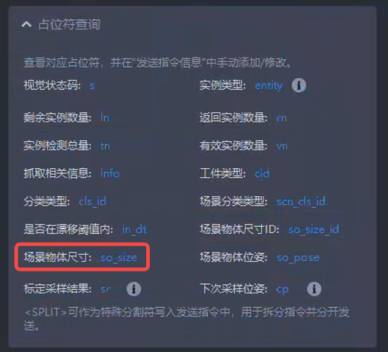</td>
   <td>返回本次识别的场景物体（一般为料框）的具体尺寸（XYZ），单位mm参考：<a href="https://dexforce.feishu.cn/wiki/MYTmwgFoCiNhV0kNsQHcMeaHn2d?from=from_copylink"> 场景物体使用指南</a></td>
   <td>所有</td>
   </tr>
   <tr>
   <td></td>
   <td>场景物体位姿</td>
   <td>so_pose</td>
   <td>系统自动分配</td>
   <td>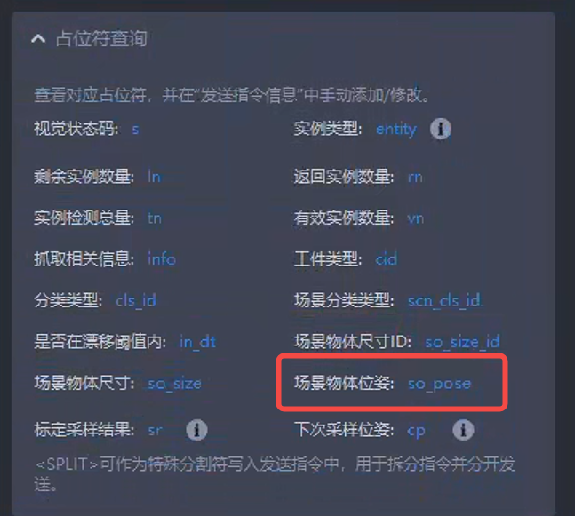</td>
   <td>返回本次识别的场景物体（一般为料框）配准姿态，单位mm参考：<a href="https://dexforce.feishu.cn/wiki/MYTmwgFoCiNhV0kNsQHcMeaHn2d?from=from_copylink"> 场景物体使用指南</a></td>
   <td>所有</td>
   </tr>
   </tbody>
   </table>

2. 支持TCP客户端。

   **适用场景**

   适用于现场设备只可作服务端的情况。

   

3. PickWiz作为服务端时，当多个机器人客户端连接，除了已连接上的客户端，其他客户端尝试连接时日志给出拒绝请求的提示。

   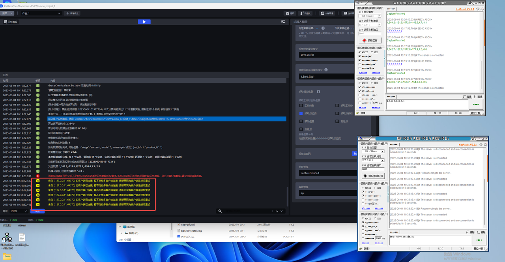

4. 使用KINGFISHER相机时，支持配置“取图完成”信号；且修改 “拍照完成” 改为 “成像完成”。

   **参数说明**

   “取图完成”代表相机拍照后获取到图像数据，但未生成点云或做图像处理，常用于一个机器人在在成像完成前发出指令信号，触发系统/脚本执行下一步操作，无需等待成像完成（因成像完成的耗时比取图完成的耗时多），一定程度可减少整体流程的耗时；“成像完成”代表相机完成取图和对图像数据进行处理。

   **使用说明**

   分别在对应的配置模块下进行完成信号的设置，通过机器人发送对应信号指令即可。

   

   

5. 新增了机器人通讯的外挂脚本。

   **功能说明**

   外挂脚本，只需要关注定制逻辑（如抓取逻辑的处理），无需涉及机器人与软件通信的部分。

   支持PickWiz端发送作业信息（如返回作业ID等）给机器人，即通信后处理；以及支持PickWiz端接收到机器人报文时进行通信前处理（如切换目标ROI ID等），具体流程见：[ 外挂脚本使用指南](https://dexforce.feishu.cn/wiki/B2nwwQpOmin5PnkC2VqcfJQPnBe)。

## 5. 一键联通

1. 一键联通新增“新模型训练框架”，新模型训练框架下的识别效果预计会优于“旧模型训练框架”，但验证量较少，如训练后效果不及预期，请提单，并同时使用“旧模型训练框架”重新训练。

   

2. 定位装配场景支持一键联通训练视觉模型和成像模型，具体使用与其他场景基本一致（见：[ 一键联通训练视觉模型](https://dexforce.feishu.cn/wiki/RlYow50mHixpxWkbJGEcO7WTn9f)[ 一键联通训练成像模型](https://dexforce.feishu.cn/wiki/JQnTw5claiCFUZkLzU8cHBYnn3f?from=from_copylink)）唯一区别在，该场景下新增了一个配置“[视野类型](https://dexforce.feishu.cn/wiki/JQnTw5claiCFUZkLzU8cHBYnn3f#share-BBUGdEJLEowzgPxGABJcU8BQnmf)”，训练前需要选择对应选项。

3. 新增了一些防呆机制：

   1. 训练成像模型时，新增 ROI工作区顶部是否距离相机原点过近 的防呆验证。

      

      

   2. 因视觉模型训练存在限制，来料形式设为紧密贴合时，每行每列的乘积最大不可超过40，否则会出现防呆弹窗。

      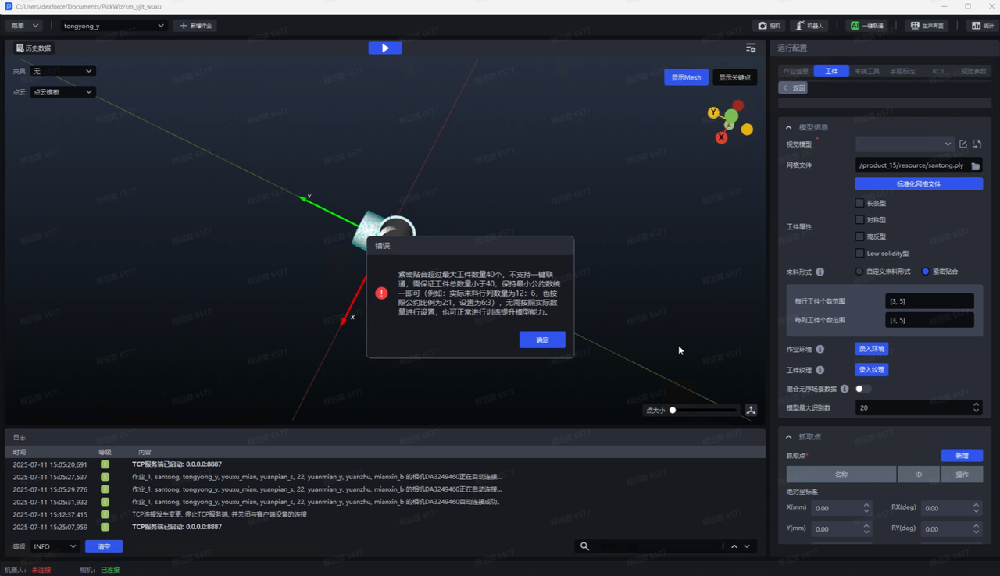

   3. 支持一键联通导出配置时，默认检验工件/料框的网格模型是否在坐标中心，若不在中心则会报警提示（下图）。

      

## 6. 视觉计算配置

1. 多个场景支持视觉加速模式。

   **功能说明**

   开启后，默认一次识别视野内所有工件实例并输出视觉结果，且视觉计算的耗时小。

   **适用场景**

   适用于工件实例数量较多且节拍要求高的场景。

   **支持场景类型**

   * 圆柱场景

     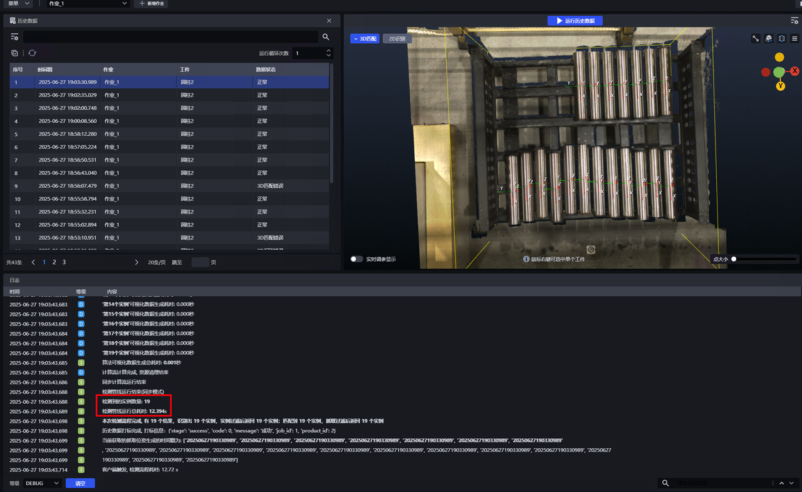

     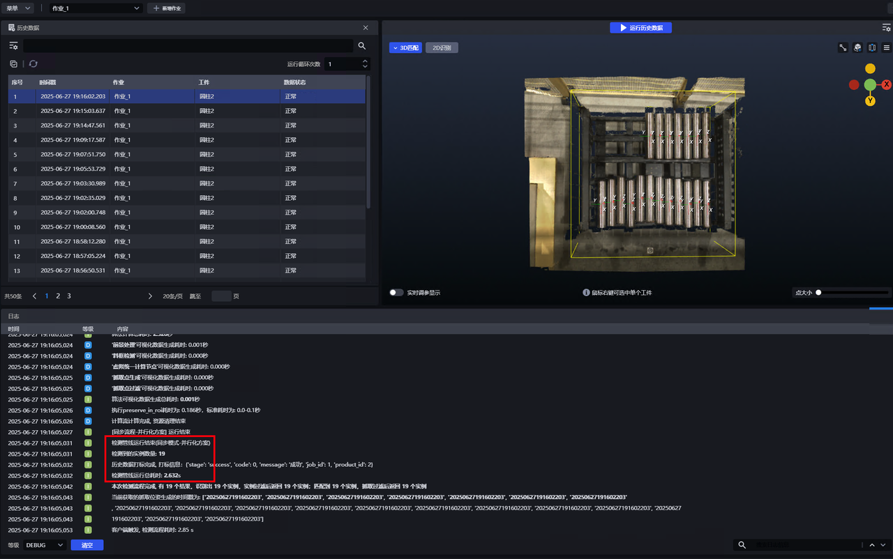

     

   * 通用工件场景

     

     

     

   * 圆面场景

     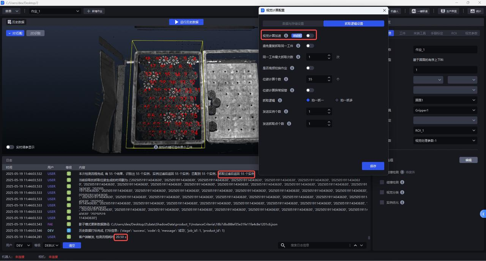

     

     

   * 拆垛场景

     

     

   > 1. 暂不支持插件场景（识别类型/局部特征/正反），后续会逐步向其他场景集成。
   >
   > 2. 视觉计算加速模式下，不支持使用以下配置：避免重复抓取同一工件、同一工件最大抓取次数、位姿计算个数、位姿计算异常报警、是否高频切换作业；且可视化的“过滤所有2D实例”配置不生效。

2. 视觉计算配置界面由平铺风格统一为标签分类，拆分为“数据与存储配置”和“抓取逻辑设置”两个标签。

   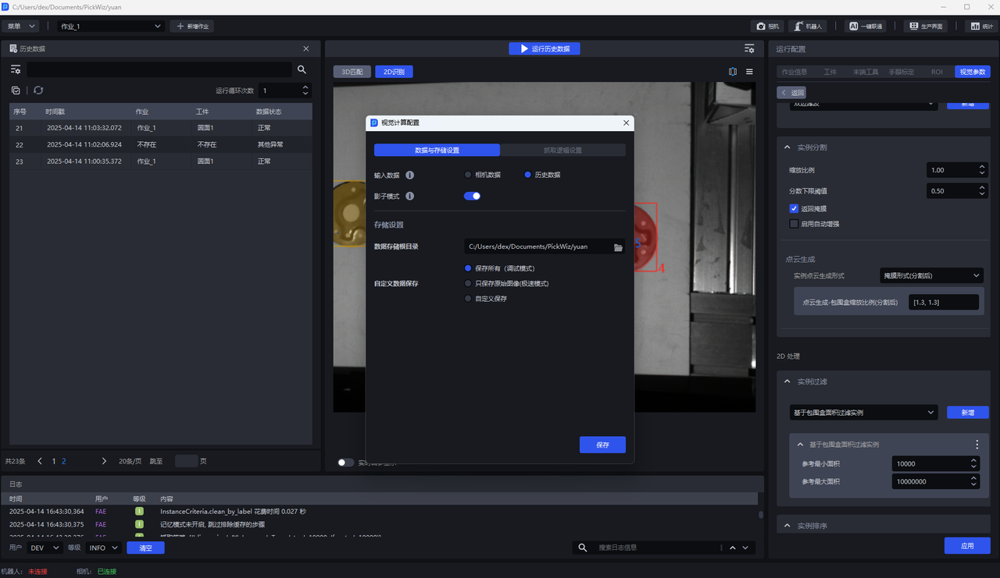

## 7. 历史数据

1. 支持仅运行计算2D识别获取模型分割结果，无需运行全流程（耗时长）再查看。

   **功能说明**

   用于查看2D识别 - 实例过滤节点的输出结果，适用于仅查看模型分割的效果。

   **使用说明**

   在视觉计算配置中，“输入数据”选择“历史数据”后，可选择“运行方式”，在“运行方式”下选择“仅运行2D识别结果”即可；且支持批量运行历史数据查看仅2D识别结果。

   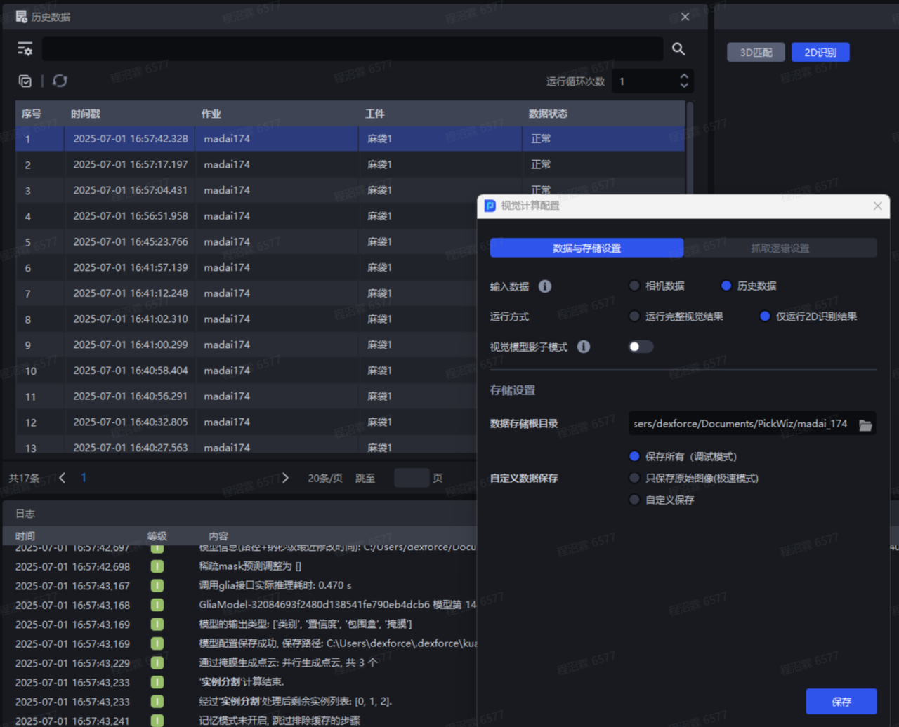

2. 当设置了“只保存原始图像（极速模式）”时，支持在历史数据模块中，鼠标右键"生成点云数据"，系统会基于原始数据生成点云，并保存在对应数据目录。

   > 解决的问题：极速模式下无点云数据，无法进行ROI调整，或点云模板需要调整，特别是相机被占用时无法获取相机数据的情况。

   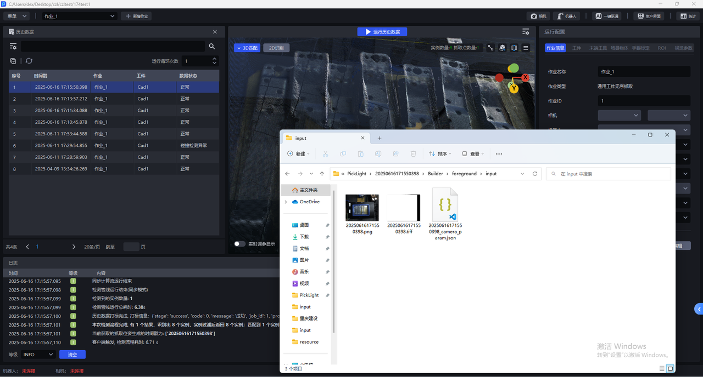

   

## 8. 工件

1. 多个场景下，新增影子模式训练模块，具体使用流程见：[ 如何使用工件影子模式](https://dexforce.feishu.cn/wiki/HUlUw9zmViZGkukQXw2cmDxEnTd)

   > 该版本支持 **通用圆柱、通用圆面、通用四边形、拆垛场景**，剩余场景则逐版本集成。

   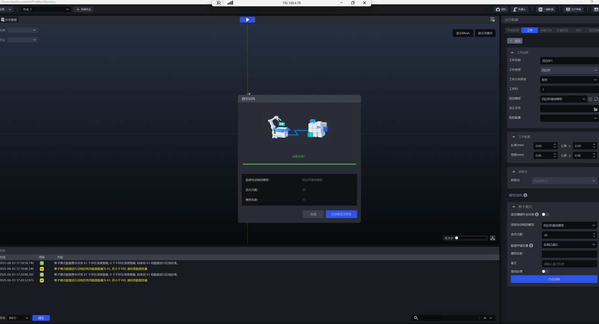

2. 圆柱场景下，抓取点的设置支持“从端点开始，根据先验尺寸估计出圆柱中心”。

   > 旧版名称“圆心”优化为“在中间位置估计出圆柱中心”，描述更加完整且直观。

   

   **适用场景**

   1. 在中间位置估计出圆柱中心：（默认值）适用于无先验尺寸/大小头工件的场景，在圆柱工件实例中间位置拟合出圆柱中心（无需先验尺寸），并基于此位置拟合出圆柱表面的抓取点。

   2. 从端点开始，根据先验尺寸估计出圆柱中心：适用于存在两/多个已知尺寸的圆柱工件实例有粘连的情况，通过尺寸估计出粘连实例中，某一端工件的中心位置，并基于此位置拟合出圆柱表面的抓取点；

      > **参考案例说明**
      >
      > 针对下图，若默认在中间位置估计圆柱中心，则会出现抓取点生成在错误位置。
      >
      > 
      >
      > 故需要选择从端点开始，根据先验尺寸估计出圆柱中心，则可以合理的避免以上情况。
      >
      > 

   > **注意**
   >
   > 在机器人通信时，传入工件先验尺寸 或 软件设置先验尺寸数值不为0时，该配置可生效；反之，数值为0时，系统默认在工件中间位置估计出圆柱中心。

3. 假面模式新增“纹理多样性”配置，支持选择 “仅包含单一假面纹理” 或 “包含多种假面纹理”，用于区分单种 或 多种纹理的训练。

   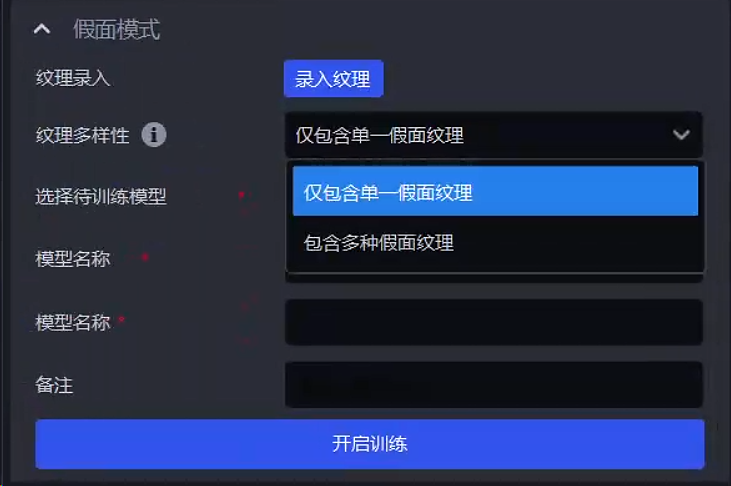

   

   

   **功能说明**

   训练前选择对应的纹理多样性配置即可，保证每个图像的每种纹理都新增2-3个或以上的样本量，有助于保证假面训练的效果。

   > **注意**
   >
   > 单一纹理迭代的模型，在兼容多种纹理的模型下是不适用的。

4. 假面模式支持一键删除所有纹理样本。

   > 解决的问题：批量导入多份错误数据后，需要一个个删除，影响效率。

5. “基于四边形有序上下料”场景下，新增“工件几何形状”属性，可选择矩形或非矩形（梯形耐火砖场景为例）。

   > 该场景名称由“基于四边形(仅矩形)有序上下料”重命名为“基于四边形有序上下料”。
   >
   > 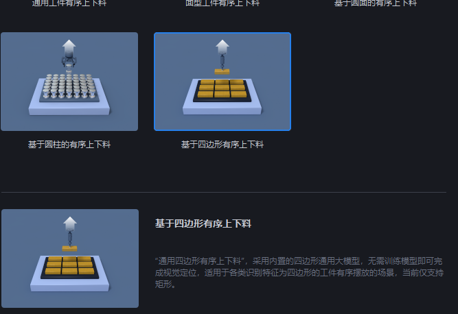

   **功能说明**

   “工件几何形状”支持切换工件现状来切换视觉算法，更好地适配不同形状的四边形工件的识别计算，提高类似耐火砖项目的交付效率；同时，提供[ 耐火砖场景交付调试流程说明](https://dexforce.feishu.cn/wiki/Uv4owNrpfiVbWWk7oUKcnb0cnzJ?from=from_copylink)，帮助你更好上手类似耐火砖项目的交付工作。

6. “识别正反”场景中，支持点云模板与抓取点编辑联动，即 显示正在编辑的抓取点对应面的点云模板。

   [20250414\_152757.mp4](files/20250414_152757.mp4)

7. 通用工件场景中，支持在导入点云文件/关键点文件时，自动校验与网格文件的坐标中心是否对齐。

   

## 9. 场景物体

1. 支持录入多种尺寸的料框，系统会根据尺寸自动识别和匹配来料料框，具体见：[ 场景物体使用指南](https://dexforce.feishu.cn/wiki/MYTmwgFoCiNhV0kNsQHcMeaHn2d?from=from_copylink)。

   **适用场景**

   多种料框尺寸（但尺寸类型有限种），且来料尺寸随机不固定。

   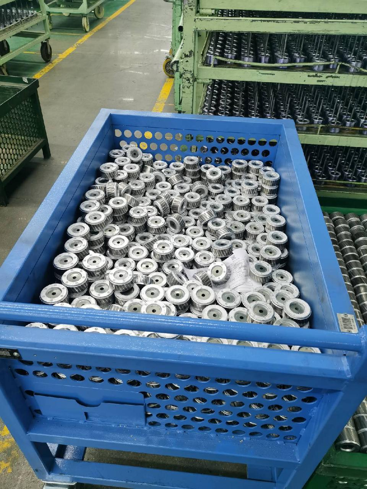

   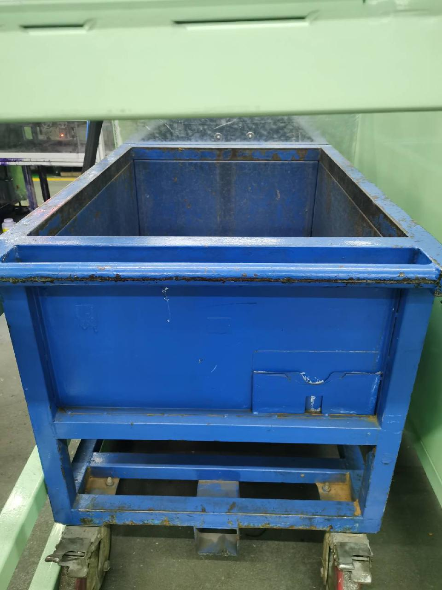

   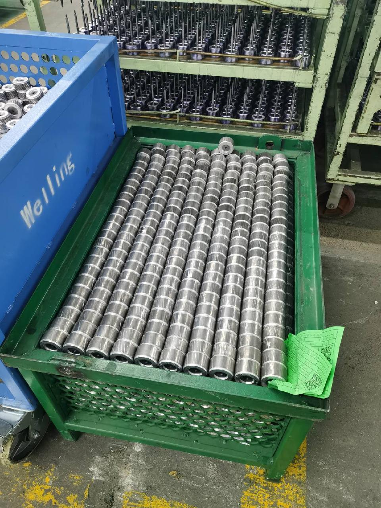

   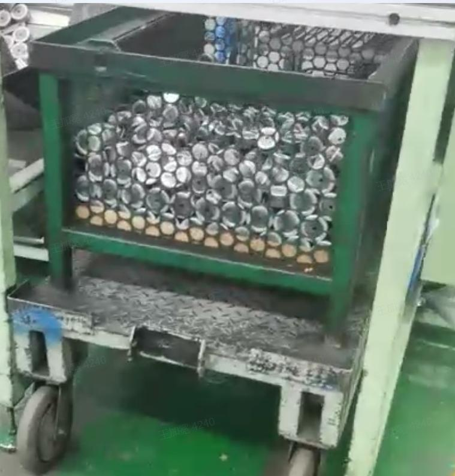

## 10. 手眼标定

1. 支持“随机姿态自动采样”，具体使用流程见：[ 随机姿态自动采样](https://dexforce.feishu.cn/wiki/SguvwWhq3ipOOJkpLcHcWn7fn8f)

   > 暂不支持三四轴机器人。
   >
   > 注意：由于三四轴机器人进行随机姿态采样/随机姿态自动采样时使用比较复杂，需要进行一次戳点，建议三四轴机器人使用戳点标定。

2. 支持使用最新相机参数重新计算手眼标定结果。

   **功能说明**

   选中的相机重新校正内外参后，支持使用校正后的新相机内外参，直接对该相机关联的手眼标定样本进行重新计算，无需重新采集样本后再计算。

   **使用说明**

   点击进入相机关联的手眼标定配置，（若检测到重新校正的相机内外参）系统会弹窗提示，你可选择覆盖旧参数并重新计算，或 不覆盖保持当前标定精度。

   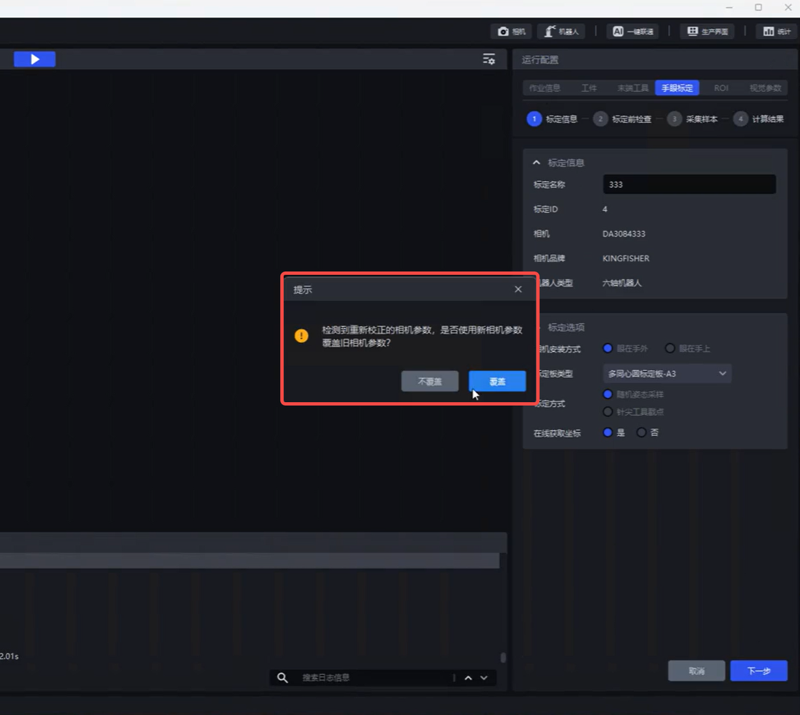

3. 在标定通信过程中，支持缓存一份机器人姿态数据，在下一次更新缓存的姿态数据前，系统都会使用缓存数据作为`新增样本`。

   > 解决的问题：部分现场可能存在机器人通信程序无法循环响应PickWiz请求的逻辑，PickWiz多次循环发送“获取坐标”的请求时，无法正常获取机器人姿态数据，从而无法`新增样本`。

## 11. 视觉参数

1. 新增了“[空ROI判断](https://dexforce.feishu.cn/wiki/P8bQwrsE0i3aACkTyJac8lfVnYc#share-XusMd7uidoikQXx3Babc24OlnIx)”节点，适用于判断ROI 3D内是否还有工件。

   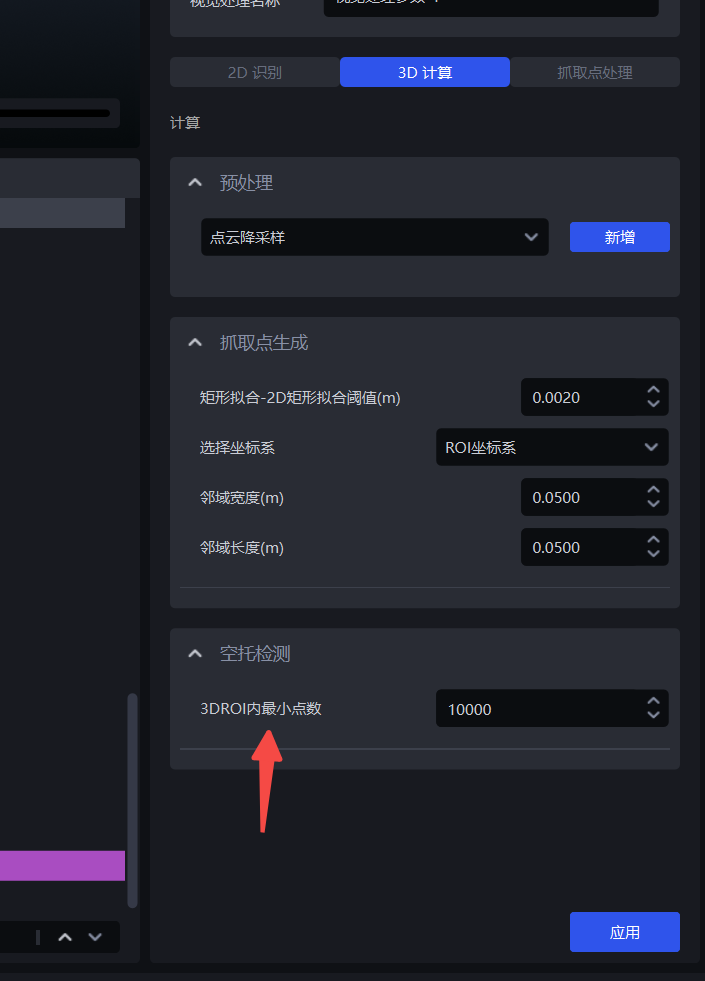

2. 碰撞检测场景新增可选函数，“保留料框ROI区域内点云（工件点云处理）”。

   **功能说明**

   具体见：[ 碰撞检测使用指南](https://dexforce.feishu.cn/wiki/XfYawGN6livINGkmcoycCvB1n2d?open_in_browser=true#share-MEz8dwQf0oPzXHxvngPcVK8VnPe)

   **适用场景**

   适用于料框壁上映射的物料影子被误识别的场景，可添加函数过滤掉误识别的实例。

   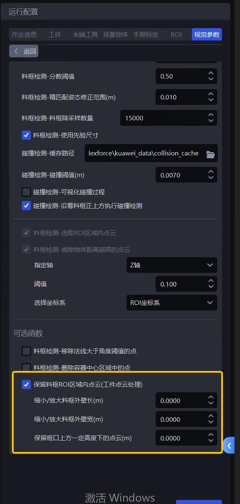

   > 保留料框ROI区域内点云后，过程数据是只能通过历史数据访问，前端显示在后续版本增加

   

3. 2D处理-实例过滤中

   1. 新增“基于三通道颜色过滤”。

      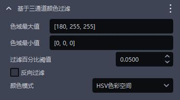

      **功能说明**

      可通过三通道颜色阈值（HSV或者RGB）过滤掉实例。

      **适用场景**

      错误实例和正确实例颜色有明显区分的情况 ，参考下图。

      

   2. 麻袋拆垛场景下，新增“基于点云数量过滤实例”。

      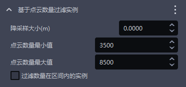

      **功能说明**

      根据检测出实例的点云数量来进行过滤。

      **适用场景**

      适用于成像曝光或其他原因，导致实例区域点云过少/噪点过多的情况。

4. 面型场景下，新增3D计算-预处理函数 “点云降采样（工件点云）”。

   **功能说明**

   可对进行精匹配的场景点云进行降采样（有别于粗匹配），建议在使用时，新增且上移至预处理函数的最上方。

   **适用场景**

   使用精匹配，但耗时高且不满足整体节拍的场景。

   > **调参建议**
   >
   > 运行后可将工件模块中的点云模版，更新为历史数据中，点云降采样后的工件点云，这一步一定程度可减少粗匹配的耗时。

   > 其他节拍提升的操作见：[ 节拍异常的常见场景与解决方案](https://dexforce.feishu.cn/wiki/ExRIwWq7NiCsMQkRljNcB3XynDb)

5. 面型工件上下料（物料相互孤立）场景下，实例分割3D节点新增了“点云生成”函数。

   **功能说明**

   点击选择 实例分割3D - 实例点云生成形式 的配置控件即可触发函数生效，具体见：[ 面型工件上下料（物料相互孤立）视觉参数调整指南](https://dexforce.feishu.cn/wiki/DzbhwEHIDi4GVlkIoDTcX2XLnlf#share-FK1JdjJqTouhhRxi08Ecukkon32)

   > **注意**
   >
   > 新增视觉参数配置时，该配置默认为不生效，只有手动选择才可触发，该机制可能存在风险[已知问题](https://dexforce.feishu.cn/wiki/XLYtwQ06niOXmykKCS3coFfPnwh#share-YNSYdEjbIoixlpxcEHecajHgnlh)，后续版本进行优化。

   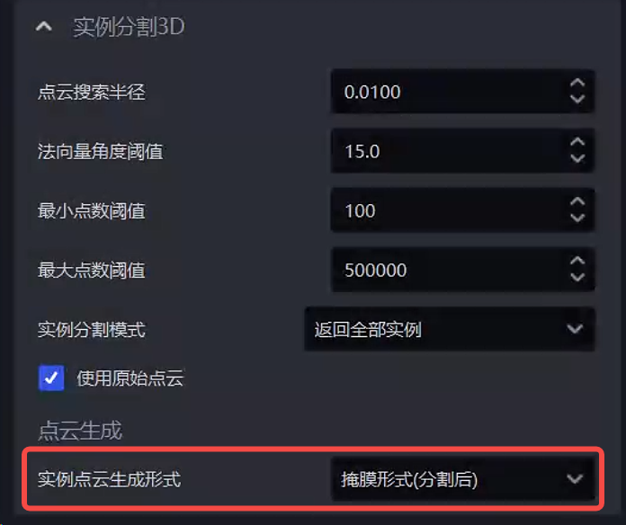

   **适用场景**

   1. 预处理为了过滤噪声删除了原始点云，但3D计算的姿态估计节点需要完整点云时，可使用“点云生成”；

      

      

   2. 当场景中的实例存在不连续（如分成两簇点云），可通过“点云生成”，扩大包围盒比例以提取完整但是点云分离的实例。

      

      

6. 圆柱场景中，3D计算 - 姿态估计节点下新增了 “圆柱姿态标准化”函数。

   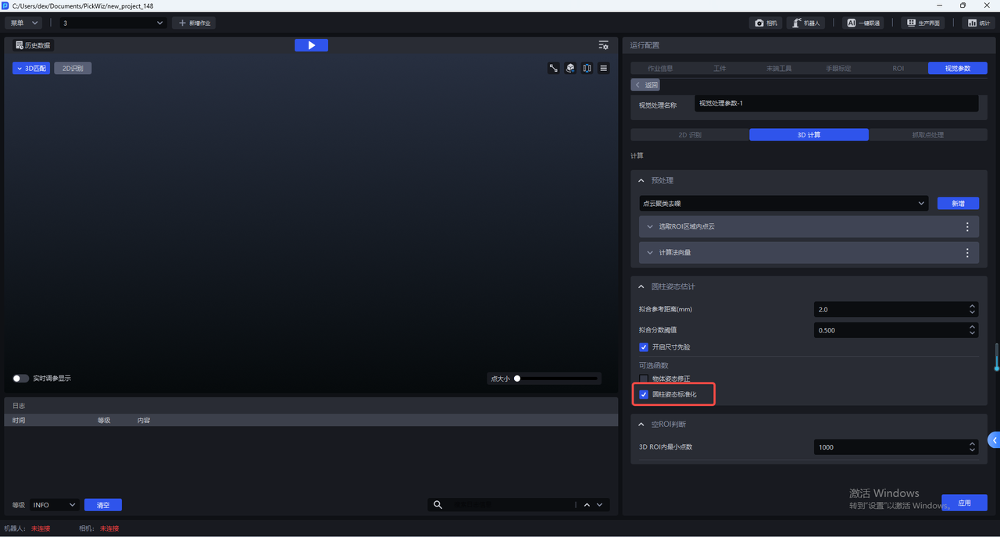

   **功能说明**

   基于有效内点在轴线方向的投影定义最优抓取的方向，（圆柱一般会按照旋转间隔生成多个抓取点在表面）即生成的抓取点中，必有一个是朝向相机原点，也是抓取成功率较高的一个方向。

   > **解决的问题**
   >
   > 1. 旧版本中，系统可能会在圆柱表面随机分布抓取点的生成角度，部分情况会导致生成的抓取点Z轴朝向倾斜过多。
   >
   >    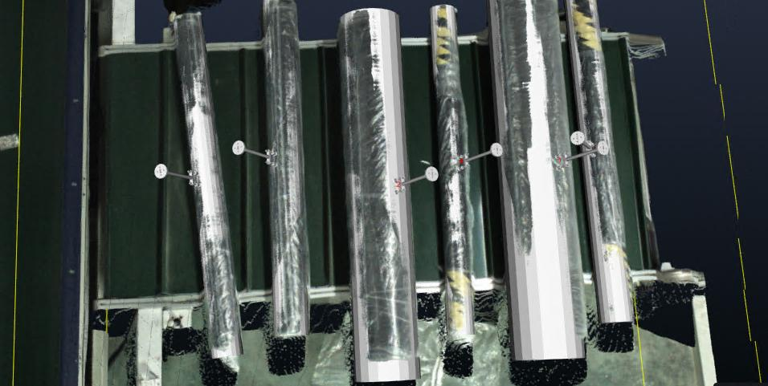
   >
   > 2. 圆柱上生成抓取点过多，导致的函数耗时过长。

7. 抓取点过滤中

   1. “过滤工件与夹具存在碰撞的抓取点”函数新增了参数 “碰撞点云采样（m）”。

      **功能说明**

      具体见：[ 通用工件视觉参数调整指南](https://dexforce.feishu.cn/wiki/M6VWwX00jiXSjpkZc3UcBqE5nVf#share-IK52dco0No6SktxYzgncMAQXnSd)

      **适用场景**

      使用该函数时，可对工件场景点云降采样，减少一定耗时。

      

      > **调试建议**
      >
      > 1. 降采样后，检测区域内的点云数量会降低，故碰撞阈值需要搭配降采样一起调整。
      >
      > 2. 防止降采样程度过大，可能会导致过滤失效。

   2. 新增“判断抓取点上层遮挡”。

      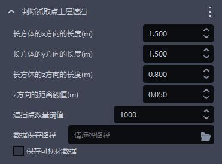

      **功能说明**

      可判断抓取工件的z方向上是否存在点云，当点云数量超过阈值时，会将该抓取点过滤。

      **适用场景**

      模型识别时会识别到下层工件，且要求一层一层抓取工件的情况，常见于拆垛/有序场景。

8. 抓取点调整中

   1. “对称中心姿态估计”函数中，新增 “姿态调整类型” 参数配置。

      

      **参数说明**

      姿态调整类型包含三种选项：

      1. 默认调整姿态：默认选中，使用对称中心进行计算，使输入姿态旋转和平移；适用于大部分情况。

      2. 仅优化平移姿态：使用输入的抓取姿态的旋转量，结合对称中心进行姿态的平移；适用于输入抓取姿态的旋转更稳定，对称中心的平移更稳定的情况。

      3. 仅优化旋转姿态：使用输入的抓取姿态的平移量，结合对称中心进行姿态的旋转；适用于输入抓取姿态的平移更稳定，对称中心的旋转更稳定的情况。

      > 姿态的稳定性指的是 实例掩膜/包围盒波动比较小/可忽略，故抓取姿态的平移/旋转不存在异常偏移。可通过 “重复定位精度” 查看平移和旋转的极值大小，判定姿态的稳定程度，平移量的误差更大，即平移稳定性低，旋转量同理。

      具体函数/参数的说明和使用见：[ 对称中心姿态优化函数说明文档](https://dexforce.feishu.cn/wiki/YQP1wSDs1iq7UnkUKvscZrgFnpd?from=from_copylink)。

   2. “调整姿态轴对齐roi中心”函数新增“指向roi中心”参数。

      **功能说明**

      勾选“指向roi中心”，视觉输出的姿态指定轴强制指向roi的中心（如下图设置，Z轴作为不变轴，保证抓取姿态的XY面不变，旋转姿态X轴指向ROI中心轴。）

      **适用场景**

      常用于使用异形夹具的场景，且需要固定/旋转抓取角度，去防止夹具凸起部分与场景物体/料框碰撞的风险。

      

9. 新增了 抓取点排序相关策略：

   1. 实例排序

      1. 掩膜面积从大到小/从小到大

      2. 可见度从大到小/从小到大

      3. 从X/Y坐标的中间到两侧/两侧到中间

      4. 从包围盒X/Y坐标的中间到两侧/两侧到中间

   2. 抓取点排序

      1. 纸箱单拆场景中，新增了“纸箱组合策略”，具体说明见：[ 拆垛视觉参数调整指南](https://dexforce.feishu.cn/wiki/HW1nw5cq2iUcVvkyynBcIHe2nig#share-R1h2daKTpop1ydxp6jLc9NrPnNc)。

         

      2. 抓取点X/Y/Z坐标值从大到小/从小到大

      3. 从抓取点X/Y坐标轴向的中间到两侧/两侧到中间

      4. 从工件姿态X/Y坐标中间到两侧/两侧到中间

## 12. 可视化

1. 支持点云测距，可用于测量工件尺寸或点间距等。

   

   [20250423100916\_rec\_.mp4](files/20250423100916_rec_.mp4)

2. 圆柱场景下，显示工件模板为圆柱网格模型，更直观地对比点云的圆柱形态。

   

3. 支持通过设置“视觉计算配置”中的“发送抓取点个数”，去过滤可视化界面中的抓取点数量的可视化信息。

   

   

   > 解决的问题：旧版本可视化会默认显示全部，无法仅显示一个最终抓取姿态，影响查看。

4. 选中单个工件后，可视化模块支持显示/隐藏坐标器，帮助查看单个工件的抓取姿态。

   

5. 支持保存可视化显示配置的状态，即关闭软件再次启动软件时，仍会按上一次的可视化显示配置，来显示可视化视窗内的数据内容。

## 13. 其他

1. 基于四边形有序上下料场景中，支持了并行化模式，可提高算法计算速度。

   > 如有需要，需要提项目支持单至研发处理。

2. 若 PickWiz 手眼标定采集的样本相似度较高，且弹出报错“与原样本相似度较高”，可通过 frozen json 配置文件取消标定样本相似度校验功能，具体使用流程见：[ 取消标定样本相似度校验](https://dexforce.feishu.cn/wiki/HlzFw2aS2iNEpkkQXhhcvzzqn7f)。

3. 支持在后台文件夹（路径为：.../dex/.dexforce/log/mixedai）下查看MixedAI相关日志，主要用于查看模型训练过程中输出的日志信息。

   

4. 当前支持外网下载所有版本的DexSense相机GUI，获取地址：[Index of /nas/dexsense\_release](http://cloud.open3dv.site:8087/nas/dexsense_release/)

