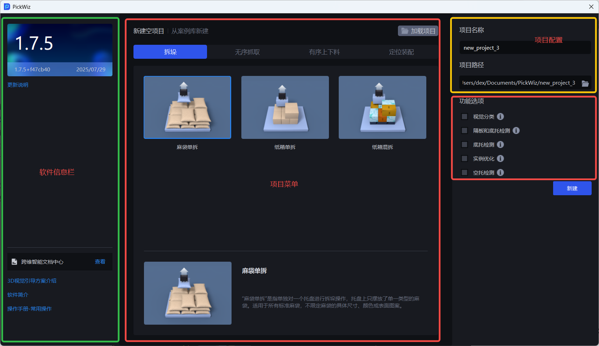
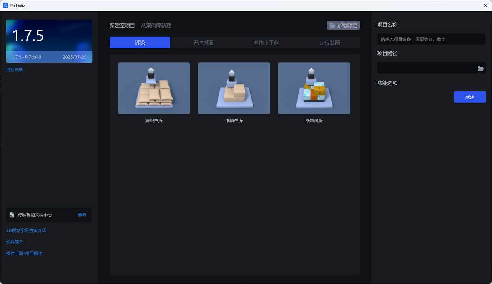
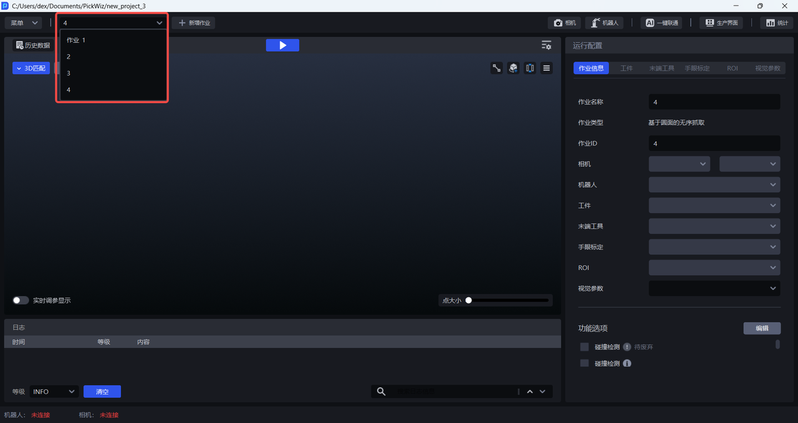
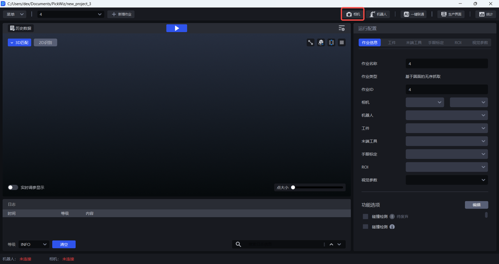
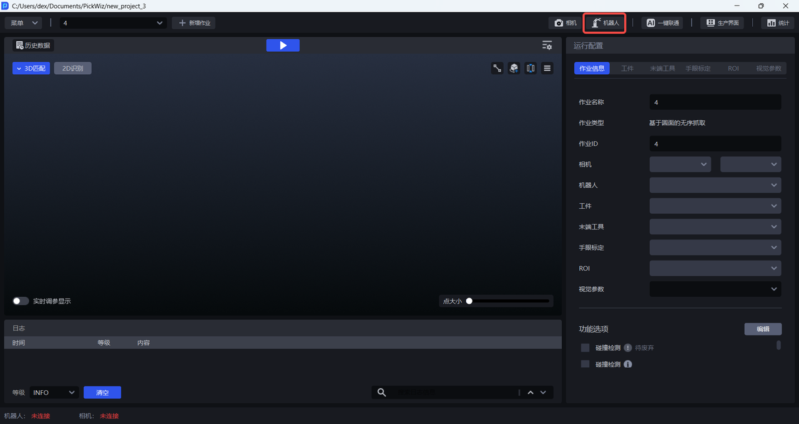
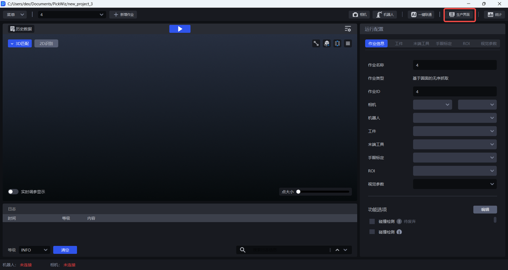
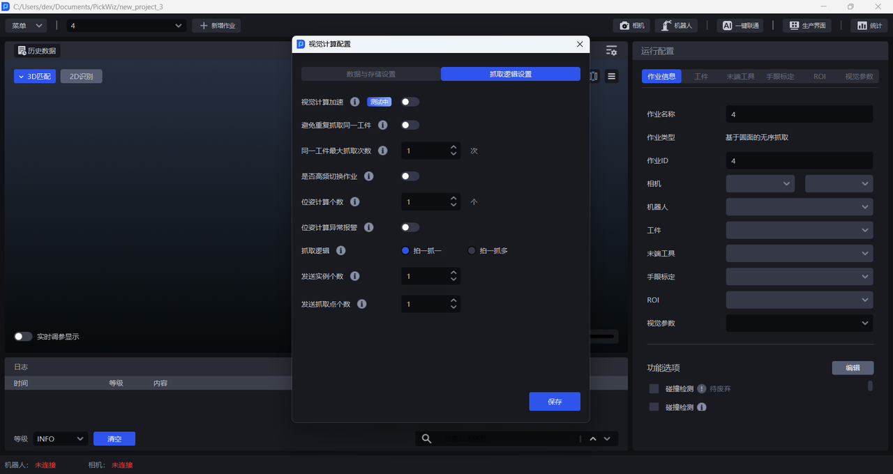
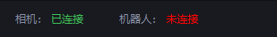

# 1. 欢迎页

安装 PickWiz 后初次打开 PickWiz，将进入欢迎页。

| **界面** | **说明**                                                                              |
| ------ | ----------------------------------------------------------------------------------- |
| 软件信息栏  | 左上角显示版本内容，左下角显示跨维智能文档中心及方案介绍、软件简介、操作手册等文档链接。                                        |
| 项目菜单   | 显示所有可选的作业场景、作业类型、功能选项。                                                              |
| 项目配置   | 新建项目时填写项目名称和项目路径，项目名称默认为 "new project" + 项目序号，项目路径默认为C:\Users\dex\Documents\PickWiz |

欢迎页支持用户 新建场景项目、加载磁盘中的项目、从案例库加载一个项目。

| **功能** | **说明**                                                                   |
| ------ | ------------------------------------------------------------------------ |
| 新建空项目  | 新建场景项目，在新建空项目选择作业场景，会自动生成一个新的项目名称，项目路径默认为C:\Users\dex\Documents\PickWiz。 |
| 从案例库新建 | 多个不同场景下不同工件的项目案例，可从案例库中下载一个包含历史数据和视觉方案的项目文件。                             |
| 加载项目   | 加载磁盘中的已有项目。                                                              |

# 2. 主界面

新建项目后将进入主界面

| **模块**                                                                                               | **说明**                                         |
| ---------------------------------------------------------------------------------------------------- | ---------------------------------------------- |
| [**菜单栏**](https://dexforce.feishu.cn/docx/JYVbdBmHcoXPgLxz8W9cXm43njc#doxcnUp6wdoWLfZGSVW24Z1YXRh)   | 提供项目、作业等相关的基本功能，以及包含菜单、相机、机器人、一键联通、生产界面、统计等功能。 |
| [**可视化视窗**](https://dexforce.feishu.cn/docx/JYVbdBmHcoXPgLxz8W9cXm43njc#doxcnfddtvSs8Nlhnh8NykxJyOf) | 可视化结果区域，实时显示3D视觉运行结果，以及包含运行、视觉计算配置、历史数据等功能。    |
| [**日志区**](https://dexforce.feishu.cn/docx/JYVbdBmHcoXPgLxz8W9cXm43njc#doxcnYvIkqpVH8f2a1V7vFSgP6O)   | 日志区域，用于实时显示日志信息，可查看运行相关数据信息，便于调试，以及包含清空、筛选等功能。 |
| [**状态栏**](https://dexforce.feishu.cn/docx/JYVbdBmHcoXPgLxz8W9cXm43njc#doxcn3OfV7cqiIX65M5Y2yVObYf)   | 状态区域，用于实时查看相机、机器人是否已成功连接。                      |
| [**配置区**](https://dexforce.feishu.cn/docx/JYVbdBmHcoXPgLxz8W9cXm43njc#doxcnxNrEfH133pD9el32ESjxxg)   | 作业相关的配置区域，包括作业信息、工件、末端工具、手眼标定、场景物体、ROI、视觉参数。   |

## 2.1 菜单栏

菜单栏包含项目、作业管理相关的基本功能，以及包含菜单、相机、机器人、一键联通、统计、历史数据等功能

* 菜单

| **功能**         | **说明**                                                             |
| -------------- | ------------------------------------------------------------------ |
| 新建项目           | 跳转欢迎页，可进行新建空项目、从案例库新建项目，或加载磁盘中已有项目。                                |
| 加载项目           | 加载磁盘中已有项目文件。                                                       |
| 打开项目文件夹        | 打开当前项目存储路径。                                                        |
| 新增作业           | 新增一个新作业场景，需要在新增作业页面中选择场景和设置作业名称。                                   |
| 复制当前作业         | 复制当前选中的作业。                                                         |
| 删除当前作业         | 删除当前选中的作业。                                                         |
| 导出与备份          | 支持自定义导出作业配置、历史数据、影子模式数据，并支持自动备份项目配置                                |
| 计算重复定位精度       | 视觉识别系统对同一物体位置进行多次识别时结果的一致性误差计算。可用于排查视觉系统识别的稳定性，影响因素包含相机精度、视觉识别精度等。 |
| 点云模板制作         | 包含标准化网格文件、点云模板制作、关键点制作、点云对齐网格四个功能，支持网格生成模板、相机采图生成模板两种点云模板制作方式      |
| 设置显示背景         | 可设置3D匹配可视化视窗的背景颜色，便于观察工件的场景点云。                                     |
| 开机时自动启动PickWiz | 开启后，开机即自动启动PickWiz                                                 |
| 语言             | 切换软件语言，目前支持中英双语；切换语言后，需要重启来激活设置。                                   |
| 关于PickWiz      | 查看产品的版本信息，包含PickWiz版本号、发布日期、加密狗有效期、PickLight / RLIA / GLIA版本号。     |

* 作业

点击可切换作业

* 相机

点击可进入相机界面，进行相机连接与调参，确保成像质量。

* 机器人

点击可进入机器人配置界面，进行机器人配置与通信操作。

* 一键联通

点击可进入一键联通界面，自动调用Dexverse后台接口创建新的训练任务，用于训练模型。

* 生产界面

点击可进入生产界面，包括实时展示设备运行状态、生产进度、设备故障等关键信息。

* 统计

统计界面主要有日期筛选、数据展示等功能

## 2.2 可视化视窗

* 点击运行栏中间的“运行”按钮，即可完整的运行一次视觉检测。

* 视觉算法进行计算时使用的配置分为“数据与存储配置”和“抓取逻辑设置”，可以根据场景项目需要进行自定义。

* 可视化区域：实时显示2D识别结果和3D匹配抓取点的结果

## 2.3 日志区

包括时间、等级、内容，根据等级分类日志记录，以及包含清空、筛选等功能

## 2.4 状态栏

显示机器人、相机的连接状态

## 2.5 配置区

配置区主要是作业运行的相关配置项，主要包括工件、末端工具、手眼标定、场景物体、ROI、视觉参数等。

| 配置项  | 说明                                                                 |
| ---- | ------------------------------------------------------------------ |
| 作业信息 | 当前作业的相关配置，包括作业名称、作业类型、作业ID、相机、机器人、工件、末端工具、场景物体、手眼标定、ROI、视觉参数、功能选项。 |
| 工件   | 当前作业的工件配置                                                          |
| 末端工具 | 当前作业的末端工具配置                                                        |
| 场景物体 | 当前作业实际场景中的各类物体，包括料框、底托等                                            |
| 手眼标定 | 当前作业的手眼标定配置                                                        |
| ROI  | 当前作业的 ROI 配置                                                       |
| 视觉参数 | 当前作业运行时的视觉参数配置                                                     |
| 功能选项 | 可选"碰撞检测"、"识别类型"、"识别局部特征"、"底托检测"等工况对应的功能                            |

